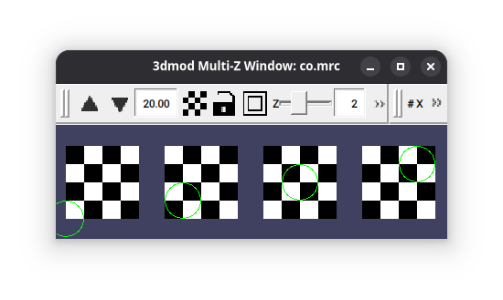
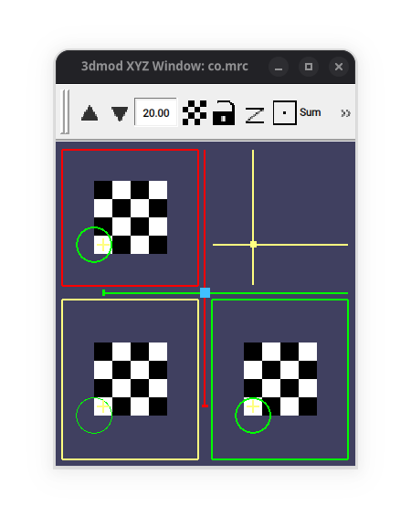

# A note about 3dmod's coordinate system

Please note that 3dmod places (0,0,0) at the bottom left corner in XY planes,
but in the center of the first Z-plane.

For example, this code:

```python
import imodmodel
import pandas as pd
import numpy as np
import mrcfile

df = pd.DataFrame(
    {
        "x": [0, 1, 2, 3],
        "y": [0, 1, 2, 3],
        "z": [0, 1, 2, 3],
    }
)

volume = np.zeros((4, 4, 4), dtype=np.float32)
for i in range(4):
    for j in range(4):
        for k in range(4):
            if (i + j + k) % 2 == 0:
                volume[i, j, k] = 1.0
                
mrcfile.write("co.mrc", volume, overwrite=True)
imodmodel.write(df, "co.mod")
```

results in the following:

<figure markdown="span">
  { width="600" }
  <figcaption>The resulting position of points in XY slices</figcaption>
</figure>

<figure markdown="span">
  { width="450" }
  <figcaption>The resulting position of (0,0,0) in XYZ slices</figcaption>
</figure>

Since many other programs place (0,0,0) in the center of the first voxel,
one might consider adding (0.5,0.5,0) to the coordinates before saving.